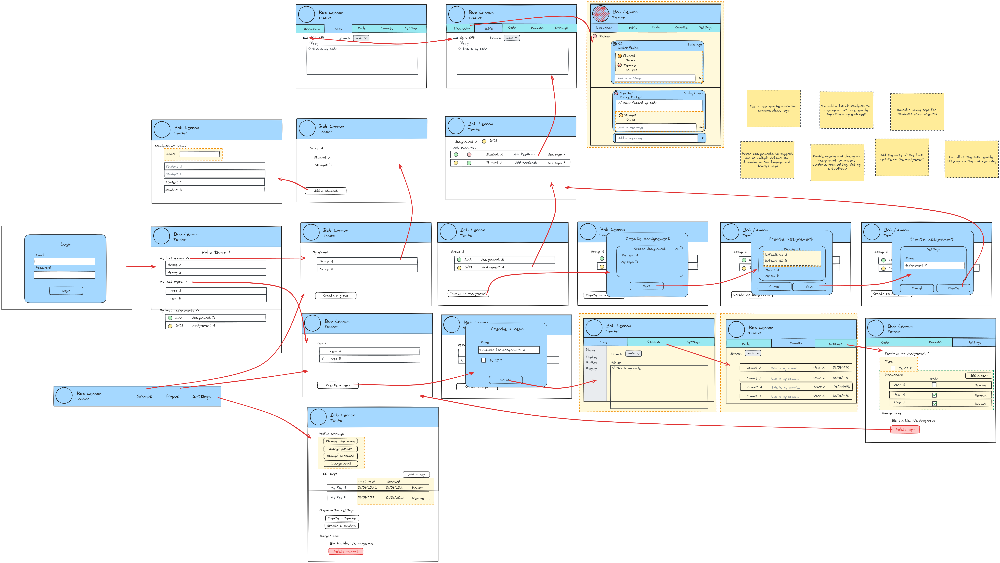

# Frontend for Git Mentor

## App UX

## Page Routing
| route                            | Name                  | Description                             | Sprint     |
|----------------------------------|-----------------------|-----------------------------------------|------------|
| /                                | Authentication        | Login page                              | Auth       |
| /[userId]                        | UserOverview          | User landing page with recaps           | DataViz2   |
| /[userId]/settings               | UserSettings          | User settings interface                 | Settings   |
| /[userId]/groups                 | UserGroupsList        | List of my groups                       | DataViz1   |
| /[userId]/assignements           | UserAssignementsList  | List of the assignements of my groups   | DataViz2   |
| /[userId]/students               | UserStudentsList      | List of the students of my groups       | DataViz2   |
| /[userId]/repositories           | RepositoriesList      | List of my repositories                 | DataViz1   |
| /[userId]/repositories/create    | RepositoryCreator     | Creator for a repository instance       | DataCreate |
| /[userId]/[reponame]             | RepositoryCode        | Repository's code                       | RepoViz    |
| /[userId]/[reponame]/commits     | RepositoryCommits     | Repository's commits                    | RepoViz    |
| /[userId]/[reponame]/settings    | RepositorySettings    | Repository's settings                   | Settings   |
| /[userId]/[reponame]/discussion  | RepositoryDiscussion  | Repository's discussion (only for stud) | Discussion |
| /[userId]/[reponame]/diffs       | RepositoryDiffs       | Repository's diffs (only for stud)      | RepoViz    |
| /groups                          | GroupsList            | List of all of the groups               | DataViz2   |
| /groups/create                   | GroupCreator          | Creator for a group instance            | DataCreate |
| /groups/settings                 | GroupSettings         | Group settings interface                | Settings   |
| /groups/[groupId]/student        | GroupStudents         | List of the students of a group         | DataViz1   |
| /groups/[groupId]/assignements   | GroupAssignements     | List of the assignements of a group     | DataViz1   |
| /assignements/create             | AssignementCreator    | Creator for an assignement instance     | DataCreate |
| /assignements/[assId]            | AssignementRepos      | List of the repos of an assignement     | DataViz1   |
| /assignements/[assId]/settings   | AssignementSettings   | Assignement settings interface          | Settings   |
| /assignements/[assId]/discussion | AssignementDiscussion | Overview of an assignement with a chat  | Discussion |
| /students                        | StudentsList          | List of all students                    | DataViz1   |
| /students/create                 | StudentCreator        | Creator for a student instance          | DataCreate |

## Sprint priority
1. DataViz1: display the first tables and navigate inside the database (6 pages)
2. Auth: Manage authentication (1 page)
3. DataCreate: enable the creation of data instances (4 pages)
4. RepoViz: enable the interactions with a repository (3 pages)
5. Settings: Manage various settings (4 page)
6. DataViz2: Advanced data visualization (4 pages)
7. Discussion: Enable user discussions (2 page)
